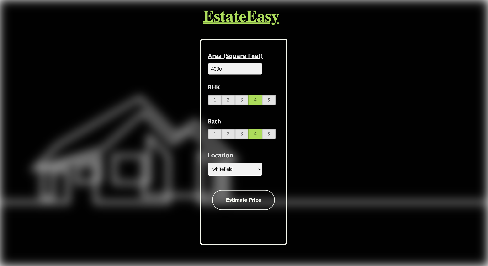
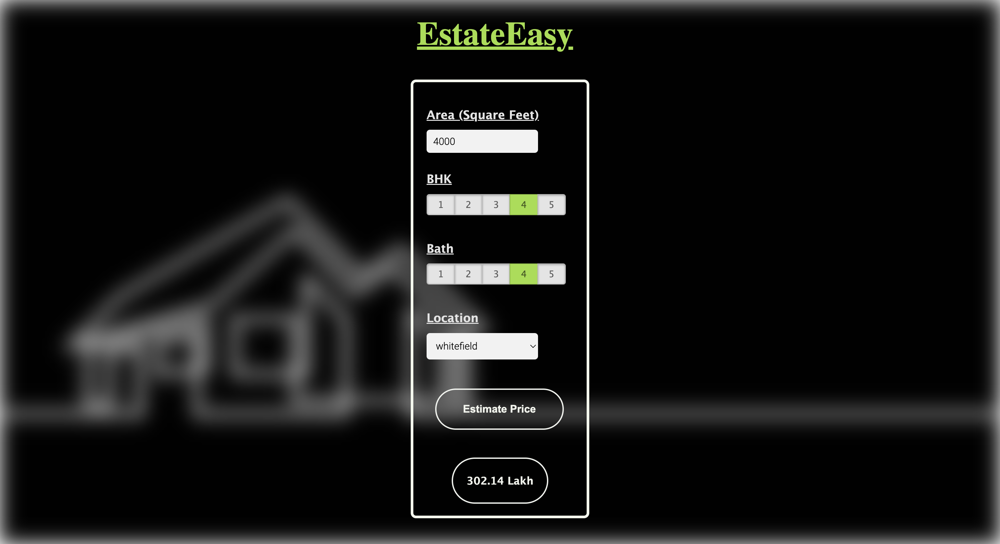

# EstateEasy




In this project, I have built a real estate price prediction website.

1. Built a model using sklearn and linear regression. 
2. Wrote a python flask server that uses the saved model(saved in a pickle file) to serve http requests. 
3. Engineered a website built using html, css and vanilla javascript that allows user to enter the square_ft area, number of bedrooms, number of bathrooms, and the location. Then using this data the frontend will call the python flask server to retrieve the predicted price. 

During model building I employed various machine learning techniques such as as data loading and cleaning, outlier detection and removal, feature engineering, dimensionality reduction, one-hot-encoding, gridsearchcv for hyperparameter tunning, k fold cross validation etc. 

Technologies utilised:

1. Python
2. Numpy and Pandas for data cleaning
3. Matplotlib for data visualization
4. Sklearn for model building
5. Jupyter notebook, visual studio as IDE
6. Flask for a http server
7. HTML/CSS/Javascript for UI

# Steps to setup this project locally:

1. Clone the repository.
```
git clone ....
```
2. Install the dependencies specified in the requirements.txt file in server subdirectory.

3. Navigate to the server subdirectory.
```
cd server
```
4. Run the server.py which starts a flask server which can deal with http requests.
```
python3 server.py
```

5. Run the server.py which starts a flask server which can deal with http requests.
```
python3 server.py
```
6. Navigate to the client subdirectory and start the liver server using the app.html file.


